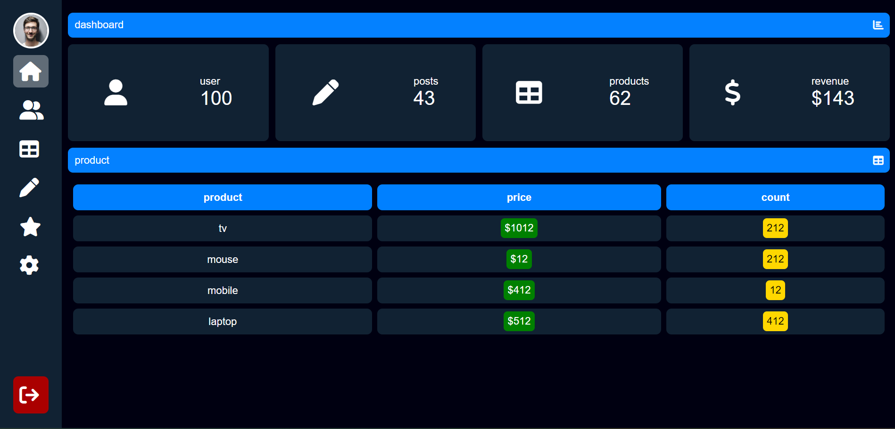

# Dashboard UI

## Description

A modern, dark-themed administrative dashboard interface designed for e-commerce and user management. This project focuses on a clean, responsive layout using CSS Flexbox and Grid to display key metrics and product data tables.

## Live Demo

🔗 https://laayar.github.io/GitHub-Portfolio/Projects/html-css-js/Dashboard/

## Features

- Summary Cards: Quick view of total users, posts, products, and revenue.
- Product Inventory Table: A detailed list of products showing pricing and stock counts.
- Side Navigation: A functional sidebar with icons for easy navigation between dashboard sections.
- Responsive Design: Dark mode UI optimized for readability and modern aesthetics.

## Technologies Used

- HTML5
- CSS3

## Screenshot

