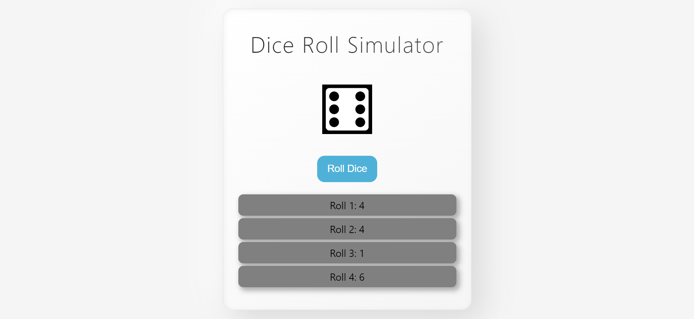

# Dice Roll Simulator

## Description
A fun and interactive web application that simulates rolling a standard six-sided die. This project allows users to generate random numbers at the click of a button and keeps a detailed history of previous rolls for easy reference.

## Live Demo
🔗 https://laayar.github.io/GitHub-Portfolio/Projects/html-css-js/Dice%20Roller/
## Features
- Random Result Generation: Uses JavaScript math functions to ensure a fair and random result between 1 and 6 every time you click "Roll Dice".
- Dynamic Dice Icons: The center display automatically updates to show the correct die face (dots) corresponding to the rolled number.
- Roll History Log: Keeps a persistent list of all previous rolls in the current session, labeling them sequentially (e.g., "Roll 1: 4", "Roll 2: 4").
- Clean Aesthetic: Features a minimalist light-themed design with soft shadows and a responsive layout.

## Technologies Used
- HTML
- CSS
- JavaScript

## Screenshot

