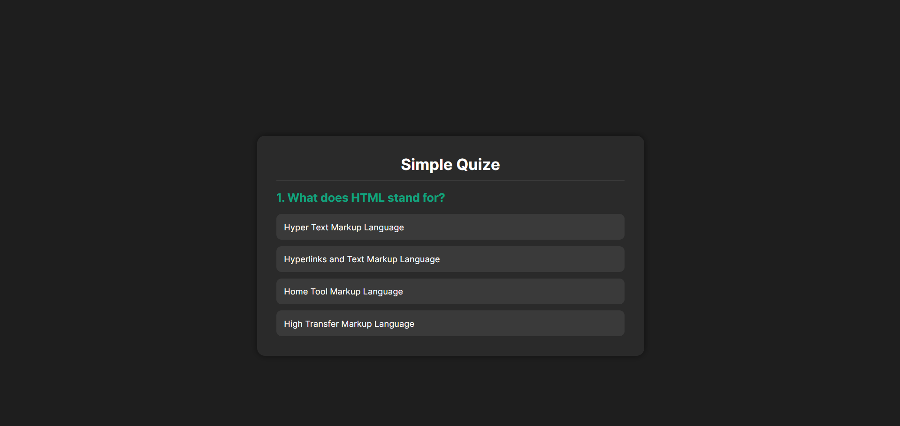

# Simple Quiz App

## Description
An interactive, web-based quiz application that tests users on web development fundamentals. The app provides instant feedback on answers and tracks the user's performance throughout 10 questions.

## Live Demo
🔗 https://laayar.github.io/GitHub-Portfolio/Projects/html-css-js/Quiz%20APP/

## Features
- Dynamic Questioning: Presents a series of 10 questions to the user.
- Visual Feedback: Highlights correct answers in green and incorrect selections in red.
- Auto-Correction: If a wrong answer is chosen, the app automatically reveals the correct option in green.
- Score Tracking: Displays a final summary screen showing the total number of correct answers (e.g., "You scored 4 out of 10").
- Replay Functionality: Includes a "Play Again" button to restart the quiz immediately.

## Technologies Used
- HTML
- CSS
- JavaScript

## Screenshot

