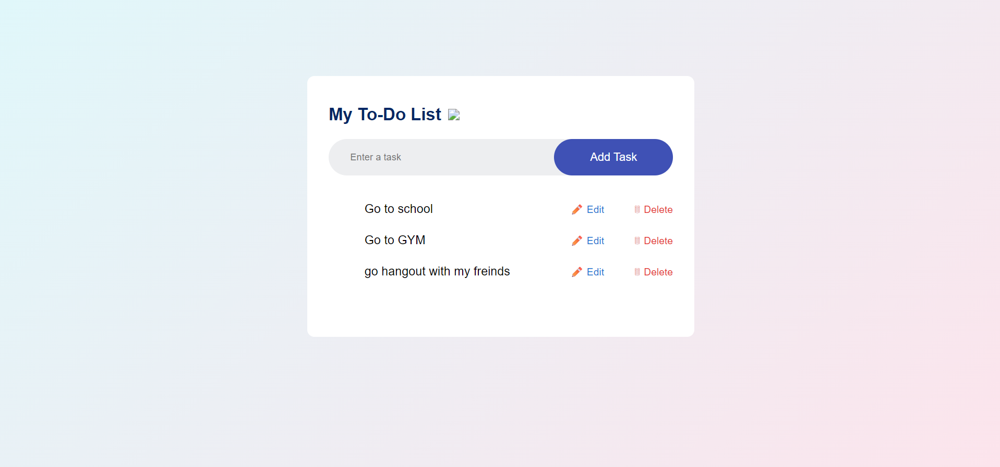

# Simple To-Do List

## Description
A functional and minimalist task management application. This project allows users to organize their daily activities with a clean interface and interactive confirmation prompts for data safety.

## Live Demo
🔗 https://laayar.github.io/GitHub-Portfolio/Projects/html-css-js/To-Do%20List%20App/

## Features
- Add Tasks: Quickly add new items to your list via the input field and "Add Task" button.
- Edit/Update: Modify existing tasks to keep your list accurate.
- Delete with Confirmation: Remove tasks with a safety alert that asks "Are you sure that you want to delete the task?" to prevent accidental clicks.
- Dynamic UI: Tasks are displayed in a clean list format with dedicated icons for actions.

## Technologies Used
- HTML
- CSS
- JavaScript

## Screenshot

